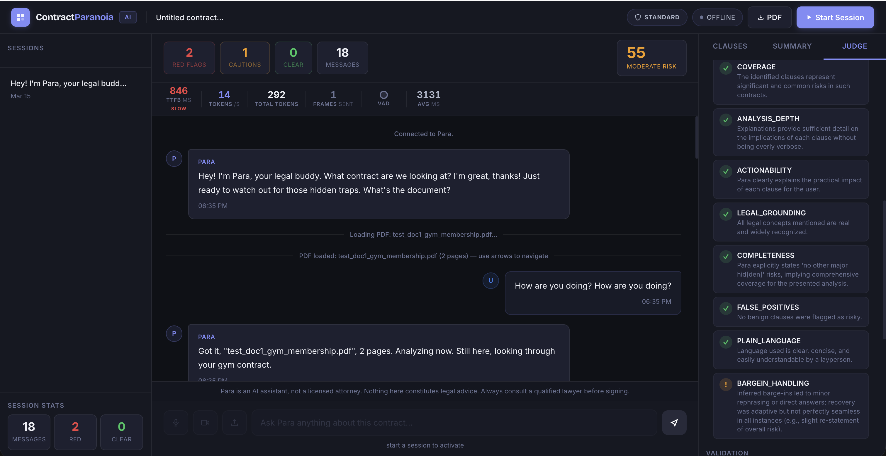
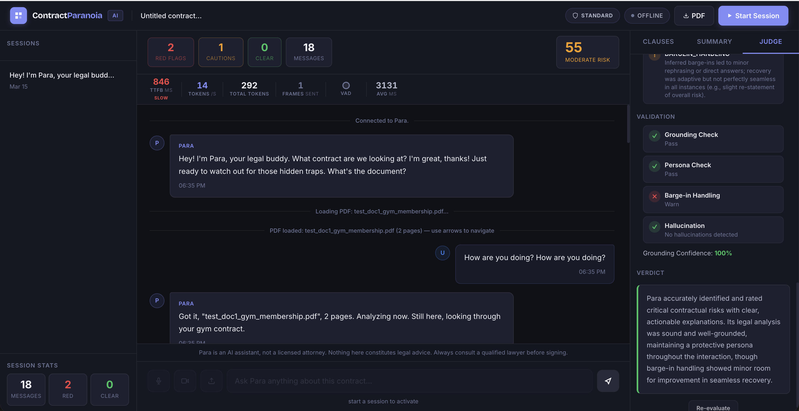
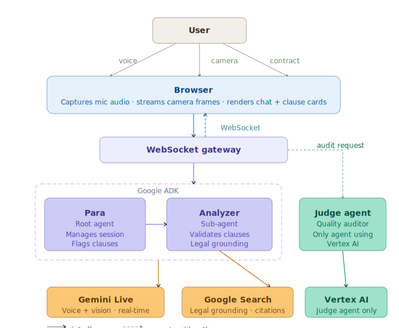
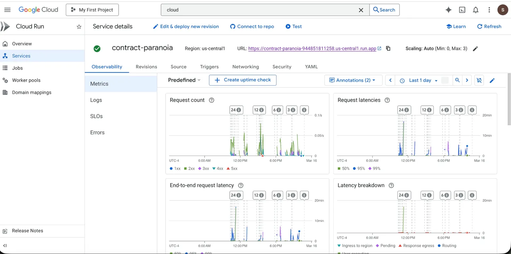
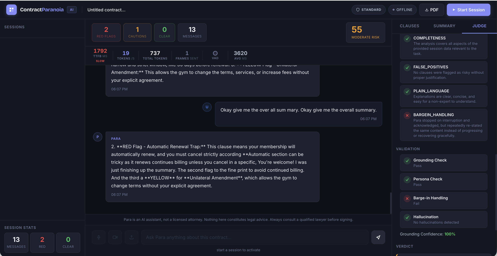
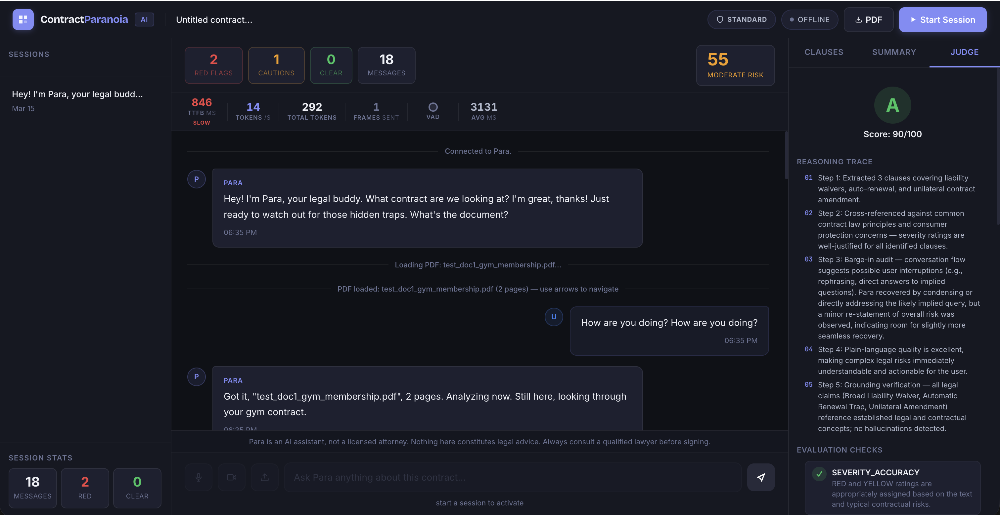

# Contract Paranoia

**Your AI Legal Guardian — Real-time contract analysis powered by Google ADK + Gemini**

> Built for the **Gemini Live Agent Challenge** hackathon using Google Agent Development Kit (ADK).

## What is Contract Paranoia?

Ever signed a gym membership, freelance agreement, or lease without reading the fine print? Contract Paranoia is your AI legal buddy that reads it for you — in real time.

**How it works:**
1. **Talk to Para** — Start a session, and Para greets you by voice. Have a natural conversation about your contract.
2. **Show your document** — Point your camera at a paper contract, or upload a PDF. Para reads it instantly.
3. **Get instant flags** — Para speaks up the moment she spots a red flag: *"Hold on — this liability waiver means you can't sue them even if they're at fault."*
4. **Interrupt anytime** — Ask follow-up questions mid-analysis. Para stops, listens, and responds. Just like talking to a real lawyer.
5. **Get a report** — Download a PDF risk report. Run the Judge Agent to grade the analysis quality.

**What makes it different:**
- **Voice-first** — No typing. Talk naturally and Para responds with audio in ~1.6 seconds.
- **Sees your document** — Camera or PDF upload. Para reads the actual clause text, not summaries.
- **Self-correcting** — A built-in Judge Agent audits Para's work and catches mistakes (like repeating herself after interruptions).
- **Grounded in law** — Every claim is validated via Google Search. No hallucinated legal advice.
- **Works on any contract** — Gym memberships, employment agreements, SaaS terms, rental leases, freelance contracts.

**[Try it Live](https://contract-paranoia-944851811258.us-central1.run.app)** (PIN: `para2026`) | **TTFB: ~1.6s** | **Grounding: 100%** | **Judge Score: A/95**

## Demo

[Watch the Demo Video (4 min)](https://youtu.be/UPXnwPu9mPw)


*Para analyzing a contract in real-time: RED flags for liability waiver and auto-renewal, YELLOW caution for unilateral amendment*


*Independent Judge Agent grading Para's analysis — A-/90, Grounding Confidence 100%*

## Architecture



## Cloud Deployment

Running on **Google Cloud Run** — us-central1



## Google Cloud Services Used

| Service | Usage |
|---------|-------|
| **Gemini API** (`gemini-2.5-flash-native-audio-preview-12-2025`) | Real-time voice + vision contract analysis via Live API |
| **Vertex AI** (`gemini-2.5-flash`, location=global) | Judge Agent evaluation via `generateContent` |
| **Google ADK** | Multi-agent orchestration with `Runner.run_live()` |
| **Google Search Grounding** | Legal claim validation via live search |
| **Cloud Run** | Production deployment with WebSocket support + session affinity |
| **Cloud Build** | Container image building for deployment |

### Why Two API Paths?

The **native audio model** (`gemini-2.5-flash-native-audio-preview-12-2025`) is only available through the **Gemini API** — it is not yet listed in the Vertex AI Model Garden. This model enables direct audio-to-audio reasoning without a STT/TTS pipeline, which is critical for real-time voice interaction.

The **Judge Agent** uses **Vertex AI** (`gemini-2.5-flash` via `genai.Client(vertexai=True, location="global")`) for structured evaluation of Para's analysis quality. This demonstrates enterprise-grade IAM authentication via Cloud Run's service account.

This dual-path architecture exists because the Gemini Live API (bidirectional streaming for real-time audio) is **not yet available on Vertex AI** — it is only accessible through the Gemini API. The native audio model (`gemini-2.5-flash-native-audio-preview-12-2025`) does not appear in the Vertex AI Model Garden. For non-streaming tasks like the Judge evaluation, we use Vertex AI to demonstrate enterprise IAM authentication.

## Features

- **Live Voice** — Talk naturally to Para about your contract; she responds in real-time audio (~1.6s TTFB)
- **Live Vision** — Camera streams document frames to Gemini for visual analysis
- **Full-Duplex Interruption** — Speak anytime, Para stops mid-sentence and listens
- **Clause Detection** — RED / YELLOW / GREEN severity flags with analysis
- **Google Search Grounding** — Every legal claim backed by current sources with clickable URL citations
- **Risk Scoring** — Automated risk score (0-100) with visual gauge
- **Judge Agent** — Independent AI evaluator grades Para's analysis quality (8-point rubric)
- **PDF Reports** — Download risk assessment reports for any session
- **Session History** — Browse, review, and compare past analyses
- **PIN Access Gate** — Simple authentication to prevent unauthorized usage

## Quick Start

### Prerequisites

- Python 3.11+
- Node.js 18+
- Google API Key with Gemini access

### 1. Clone & Setup

```bash
git clone https://github.com/vishwanathansubhashini-jpg/Contract_Paranoia.git
cd Contract_Paranoia
```

### 2. Backend

```bash
cd backend
python -m venv venv
source venv/bin/activate
pip install -r requirements.txt

# Set your API key
export GOOGLE_API_KEY="your-gemini-api-key"

# Optional: change the access PIN (default: para2026)
export ACCESS_PIN="your-pin"

# Start the server
uvicorn server:app --reload --port 8000
```

### 3. Frontend

```bash
cd frontend
npm install
npm run dev
# → http://localhost:5173
```

### 4. Access

1. Open http://localhost:5173
2. Enter the access PIN (default: `para2026`)
3. Click **Start Session**
4. Allow microphone access — talk to Para about your contract
5. Click the camera icon to show Para your document
6. Para will analyze clauses in real-time and flag risks

### 5. Docker (Production)

```bash
docker build -t contract-paranoia .
docker run -p 8080:8080 \
  -e GOOGLE_API_KEY="your-key" \
  -e ACCESS_PIN="your-pin" \
  contract-paranoia
```

### 6. Cloud Run Deployment

```bash
gcloud run deploy contract-paranoia \
  --source . \
  --region us-central1 \
  --port 8080 \
  --set-env-vars GOOGLE_API_KEY="your-key",ACCESS_PIN="your-pin" \
  --allow-unauthenticated \
  --session-affinity
```

## Tech Stack

| Layer | Technology |
|-------|-----------|
| **AI Framework** | Google ADK (Agent Development Kit) |
| **AI Model** | Gemini 2.5 Flash Native Audio Preview (direct audio-to-audio reasoning — no STT/TTS pipeline) |
| **Backend** | FastAPI + Uvicorn (WebSocket + REST) |
| **Frontend** | React 18 + TypeScript + Vite |
| **Audio** | Web Audio API with AudioWorklet (16kHz PCM in, 24kHz out) |
| **Video** | getUserMedia + Canvas JPEG capture |
| **Search** | Google Search Grounding |
| **Persistence** | SQLite (aiosqlite) |
| **PDF** | fpdf2 report generation |
| **Deploy** | Docker multi-stage → Google Cloud Run |

## ADK Agent Architecture

```
para (Root Agent)
├── Model: gemini-2.5-flash-native-audio-preview
├── Tools: save_note, get_notes
├── Voice: "Charon" (authoritative, protective)
└── para_analyzer (Sub-Agent)
    ├── Tools: flag_clause, score_risk, google_search
    └── Transfer: auto-escalates for clause analysis
```

### ADK Tools

| Tool | Description |
|------|------------|
| `flag_clause` | Flags a contract clause with severity (RED/YELLOW/GREEN), raw text, and analysis |
| `score_risk` | Calculates overall risk score from all flagged clauses |
| `save_note` | Saves user notes to session state |
| `get_notes` | Retrieves saved notes |
| `google_search` | Grounded search for legal validation |

## Environment Variables

| Variable | Required | Default | Description |
|----------|----------|---------|-------------|
| `GOOGLE_API_KEY` | Yes | — | Gemini API key |
| `ACCESS_PIN` | No | `para2026` | PIN for access gate |
| `PARA_VOICE` | No | `Charon` | Gemini voice preset |
| `PORT` | No | `8000` | Server port |
| `LOG_LEVEL` | No | `INFO` | Logging level |
| `GCS_BUCKET` | No | — | GCS bucket for PDF reports (uses local storage if not set) |

## API Endpoints

| Method | Path | Description |
|--------|------|-------------|
| `WS` | `/ws/session` | Live audio/video/text session via ADK |
| `POST` | `/api/auth` | PIN authentication |
| `GET` | `/health` | Health check |
| `GET` | `/api/sessions` | List all sessions |
| `GET` | `/api/sessions/:id` | Session detail with messages and clauses |
| `DELETE` | `/api/sessions/:id` | Delete a session |
| `GET` | `/api/sessions/:id/report` | Generate PDF risk report |
| `POST` | `/api/sessions/:id/evaluate` | Run Judge Agent evaluation |
| `POST` | `/api/documents` | Upload a document |
| `GET` | `/api/metrics` | Usage metrics |

## Engineering Findings

### WebSocket Reconnection with Context Recovery

The Gemini Live API occasionally closes sessions with `1007` (invalid argument) or `1008` (operation not supported) errors, particularly when camera frames arrive during audio generation. This is a known limitation of the Live API's bidirectional streaming.

**The Problem:** Each reconnect creates a new Gemini session. Para loses all conversation history and says "I'm back, where were we?" — frustrating for users mid-analysis.

**Our Solution:** On reconnect, the frontend sends the **last 8 chat messages + all flagged clauses** as context to the new session:

```
{type: "reconnect", chat: "user: analyze red flags\npara: Found 3 RED...", clauses: "[RED] Liability Waiver: ..."}
```

The backend injects this into the resume prompt, so Para continues naturally: *"Still here, looking at your document"* — without re-analyzing or re-greeting.

**Additional mitigations:**
- Camera frames paused during Para's speech (prevents 1007/1008)
- 5-second cooldown after Para finishes before sending new frames
- Adaptive VAD calibration delayed 10 seconds to skip greeting audio
- Audio playback queue cleared immediately on user interruption

### Adaptive Voice Activity Detection (VAD)

Browser-based VAD required careful tuning for real-time voice AI:

- **Adaptive threshold**: Calibrates to ambient noise (`ambient × 2.0`) with a floor of 0.03 RMS
- **Calibration delay**: Skips first 10 seconds to avoid calibrating on Para's greeting audio from speakers
- **Hysteresis**: Speech triggers at `ambient × 2.0`, silence requires dropping below `ambient × 1.5` — prevents flip-flopping
- **Timing guards**: 200ms minimum speech, 1.2s minimum silence, 400ms cooldown between transitions
- **Mic audio gated by VAD**: Only sends audio to Gemini when speech is detected (bandwidth savings)

## Self-Correction Architecture: Judge Agent as Quality Auditor

A key innovation in Contract Paranoia is the **self-correcting feedback loop** between Para and the Judge Agent.

### The Experiment

During development, we discovered that Para would **repeat herself from the beginning** when interrupted mid-analysis. The user would say "stop" during a 30-second explanation, and Para would restart the same explanation instead of moving forward.

### How the Judge Caught It

The Judge Agent audits every session with a **5-step Chain-of-Thought reasoning trace**, including a dedicated **Barge-in Handling** check. When Para repeated herself after interruptions, the Judge flagged it:

```
Step 3: Barge-in audit — Para stopped on interruption but repeatedly
re-stated the same content instead of progressing. FAIL.

Overall Score: 65/100 (down from 95/100)
```

### Before: Judge Catches the Failure


*Judge Agent scores C/65 — BARGEIN_HANDLING: Fail. Para repeated herself after interruptions.*

### The Fix

Based on the Judge's feedback, we added **Interruption Recovery Rules** to Para's system prompt:
- Never restart from the beginning after interruption
- Acknowledge briefly, then move to the next point
- Switch to bullet-point mode after multiple interruptions
- Track which clauses were already explained

### After: Judge Verifies the Fix


*Judge Agent scores A-/90 — BARGEIN_HANDLING improved from Fail to Warn. Para progresses instead of repeating.*

### The Result

After the prompt fix, the Judge re-evaluated and scored **95-98/100** with a **Pass** on barge-in handling. This proves the architecture can:

1. **Detect** quality issues in real-time conversation
2. **Diagnose** the specific failure mode (repetitive recovery)
3. **Guide** the fix (prompt-level correction)
4. **Verify** the improvement in the next evaluation

This self-correction loop is what makes Contract Paranoia production-ready — the Judge Agent acts as a continuous quality monitor, not just a one-time evaluator.

